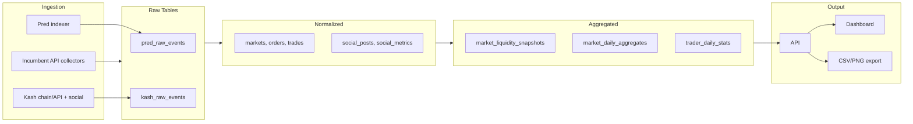

# Liquidity Intelligence Console – Agent Context

## What This Project Is

The **Liquidity Intelligence Console** ingests, normalizes, and analyzes event-level data from:

- **Pred**: A Base-native, order-book sports prediction exchange (200 ms execution, sub-2% spreads).
- **Kash**: A social-native, AI-powered prediction market on X; users trade via @kash_bot with a bonding-curve AMM.

The console exposes institutional-grade liquidity, market-quality, and behavior metrics via a web dashboard and exportable artifacts (diagnostics, reports, benchmarks). Goal: give founders an objective, third-party view of spreads, depth, and participant behavior, and distinguish real liquidity from incentive-driven or whale-dominated activity.

## Personas

- **Founders / Execs (Pred, Kash)**: High-level KPIs and comparisons vs incumbents (e.g. Kalshi, Polymarket).
- **Quant / Product Analysts**: Flexible queries on spreads, depth, and user cohorts.
- **Builder**: A coherent system explainable in a 15–30 min technical deep dive.

## Core Use Cases

- View **per-market health**: spreads, depth, volume, unique traders over time.
- Identify **whale-dominated markets** and potential wash-trading patterns.
- See how **social virality (Kash)** maps into liquidity and persistence.
- **Compare** Pred/Kash headline metrics to Kalshi/Polymarket benchmarks.

## Architecture (High Level)

- **Ingestion workers** (Pred indexer, Kash chain/API + social, incumbent API) write into **raw** tables (append-only).
- **Normalization** (SQL/scripts) fills **normalized** entities: platforms, markets, orders, trades, wallets, social_*.
- **Analytics** (batch or streaming) fills **aggregated** tables: market_liquidity_snapshots, market_daily_aggregates, trader_daily_stats.
- **API + Next.js dashboard** read from normalized and aggregated tables; **export** layer serves CSV and PNG charts.

## Phases

1. **Phase 1 – Recon & schema (Weeks 1–2)**: Confirm Pred/Kash APIs/ABIs; finalize MVP schema (platforms, markets, raw + normalized + key aggregates).
2. **Phase 2 – Ingestion & storage (Weeks 3–6)**: Indexers → raw tables; normalization → core tables; first market_daily_aggregates pipeline.
3. **Phase 3 – Analytics & consulting drafts (Weeks 7–8)**: Fill aggregates and liquidity snapshots; draft Pred Liquidity Diagnostic, Kash Social-Liquidity Report, incumbent benchmarks.
4. **Phase 4 – Founder-ready packaging (Week 9)**: Polish dashboard UX; export 3–5 high-impact charts and a short deck traceable to schema/queries.

## Key Entities

- **Reference**: `platforms`, `markets`, `market_outcomes`, `wallets`.
- **Pred**: `pred_raw_events`, `orders`, `trades`; optional `positions`.
- **Kash**: `kash_raw_events`, `amm_trades`, `social_posts`, `social_metrics`, `social_market_links`, `social_sentiment`.
- **Unified facts**: `market_liquidity_snapshots`, `market_daily_aggregates`, `trader_daily_stats`.

## Stack

- **Database**: Postgres (Supabase).
- **API + UI**: Next.js (App Router, API routes).
- **Analytics**: Python and/or SQL for batch/streaming jobs.
- **Tooling**: Bun for scripts and Node tooling.

## Important Conventions

- Keep **raw** tables append-only; use natural keys `(block_number, tx_hash, log_index)` for idempotent ingestion.
- **Partition** large time-series tables by date; use **indexes** on `(market_id, timestamp)` and `(wallet_id, date)` for analytics.
- Secrets (API keys for X, LLM, etc.) in environment variables or a secret store; never in repo.

## ETHSKILLS (Ethereum / indexer context)

When working on **chain ingestion** (Pred indexer, Kash onchain), **Base/L2**, **contract addresses**, or **dashboard UX** (addresses, tx links, loaders), use the local ethskills in [.cursor/ethskills/](.cursor/ethskills/):

- **Indexer + pipeline:** Read [.cursor/ethskills/indexing.md](.cursor/ethskills/indexing.md) and [.cursor/ethskills/l2s.md](.cursor/ethskills/l2s.md). Use [.cursor/ethskills/addresses.md](.cursor/ethskills/addresses.md) for verified contract addresses (never guess). Use [.cursor/ethskills/tools.md](.cursor/ethskills/tools.md) for RPCs, explorers, viem.
- **Design / incentives:** Read [.cursor/ethskills/concepts.md](.cursor/ethskills/concepts.md). For event/ERC context use [.cursor/ethskills/standards.md](.cursor/ethskills/standards.md).
- **Dashboard (Next.js):** If showing wallet addresses, chain IDs, or tx links, follow [.cursor/ethskills/frontend-ux.md](.cursor/ethskills/frontend-ux.md).
- **Full-flow planning:** Start with [.cursor/ethskills/ship.md](.cursor/ethskills/ship.md) to route to other skills by phase.

Source: [ethskills.com](https://ethskills.com/). See [.cursor/ethskills/README.md](.cursor/ethskills/README.md) for the full list and when to use each.
